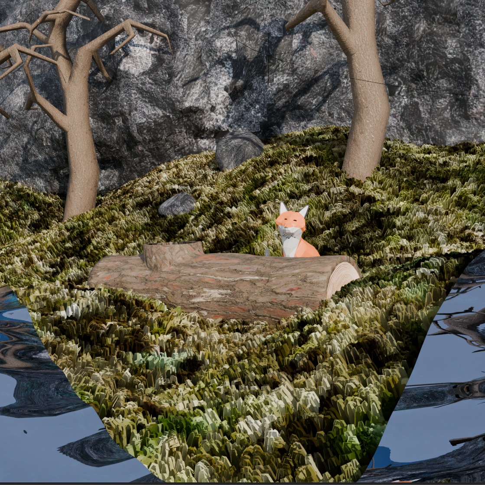
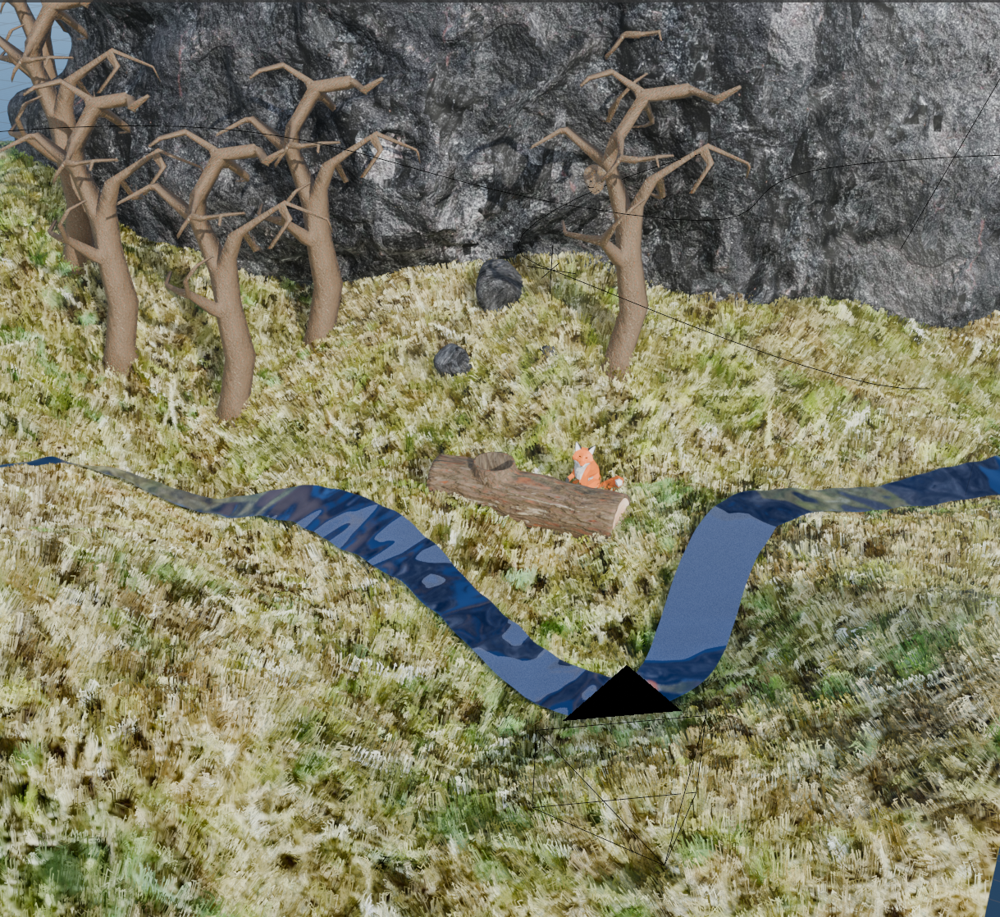
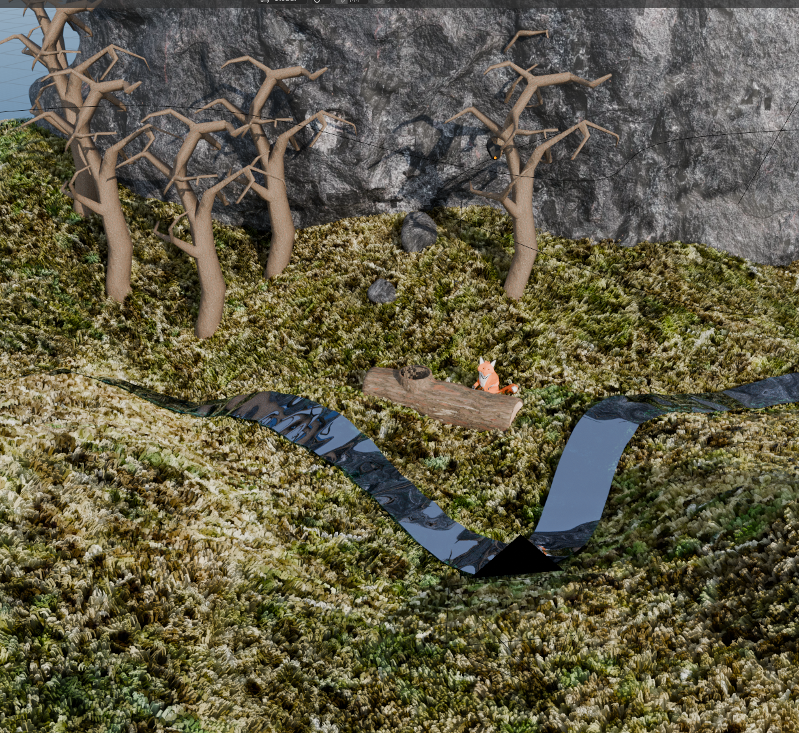
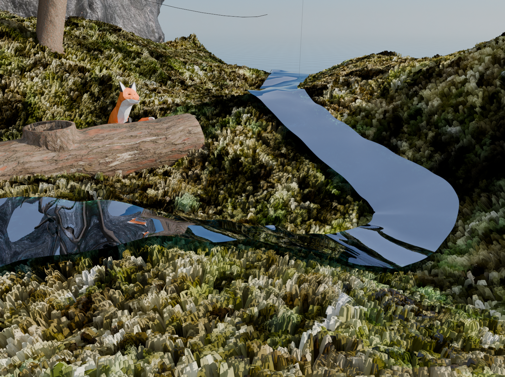
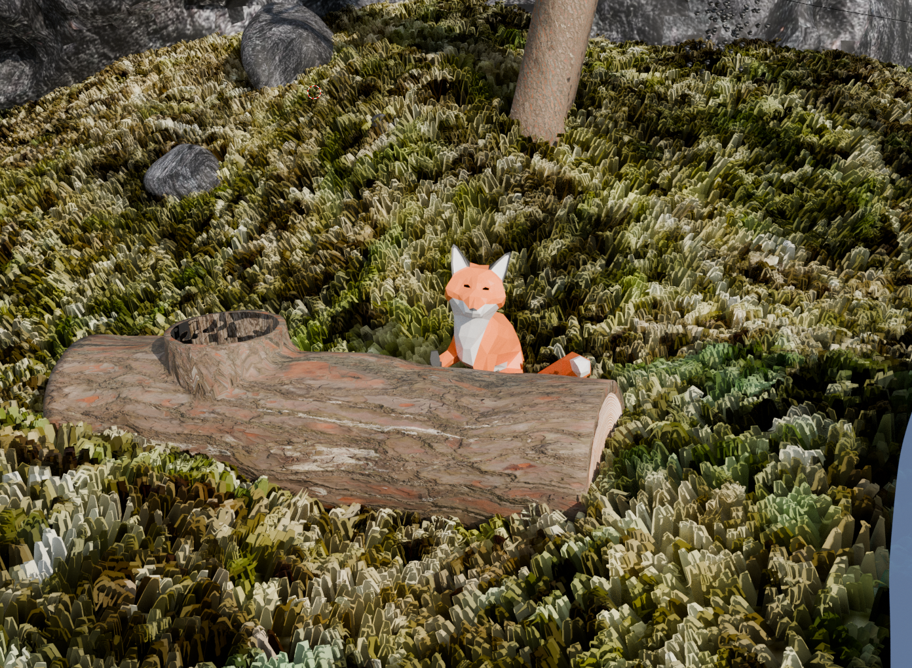
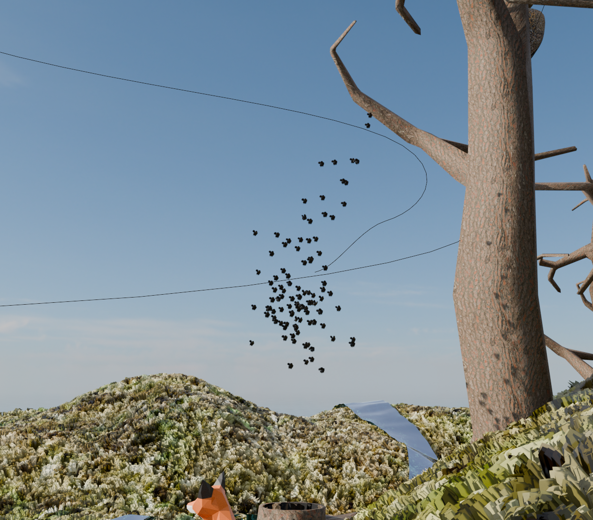

### Fakultet elektrotehnike i računarstva, Sveučilište u Zagrebu
### Akademska godina: 2024./2025.
### Autor: Davor Najev

<figure>
  
  <figcaption>Pokazna slika renderirane scene</figcaption>
</figure>

## Opis projekta
Projekt je pokazna scena napravljena u Blenderu.
Izvorna datoteka projekta je `projekt.blend`, a renderirane scene se nalaze u
datotekama projekt_eevee.mkv i projekt_cycles.mkv, renderirane s Blenderovim renderim
EEVEE i Cycles.
U `assets` direktoriju se nalaze dodatni asseti koji se koriste pri renderiranju.

## Opis scene
Scena prikazuje šumu/travnjak s par stabala pokraj litice.
U centru pozornosti je lisica koja se nalazi iza dubla srušenog stabla.
Između uzbrdica u terenu teče potočić.
U jednom trenutku padne par kamenja s litice što privuče pozornost lisice
i preplaši pčele iz pčelinjaka.

## Tehnike implementiranja
- Teren: proceduralno generiran pomoću geometry nodeova iz vodoravno postavljene ravnine.
Moguće je povećavati ili smanjivati ravninu, teren će se prilagoditi i ponovno proceduralno generirati.
Drvo je modelirano jednom te instancirano više puta pomoću `InstanceOnPoints` geometry nodea.
Trava je modelirana čestičnim sustavom (napomena: trava najviše ruši performance pa 
ju preporučujem onemogućiti u viewportu).

<figure>
    

        
        
    

    <figcaption>Slika terena renderiranog odozgora s EEVEE (lijevo) i Cycles (desno)</figcaption>
    </figure>

- Potočić: proceduralno generiran pomoću geometry nodeova iz Bezierove krivulje.
Moguće je proizvoljno dodavati segmente krivulje i pomicati ih, potočić će biti projiciran
na teren i teći će u ispravnom smjeru.
Moguće je dodati još potočića dodavanjem novih Bezierovih krivulja i dodavanjem istog
geometry nodea u modifikatorima.

<figure>
  
  <figcaption>Slika potočića</figcaption>
</figure>

- Lisica: izrađena tehnikom low-poly modeliranja. Sadrži kostur generiran pomoću dodatka Riggify.
Okret gornjeg dijela tijela je animiran pomoću ključnih okvira.
<figure>
  
  <figcaption>Slika lisice iza debla</figcaption>
</figure>

- Deblo: izrađeno kombinirano spajanjem 2 cilindra booleovim operacijama i skulpturiranjem.
- Litica: izrađena skulpturiranjem. Za kamenja koja padaju s litice koristi se RigidBody za
interakciju s terenom.
- Roj pčela: čestični sustav boida. Model pčele je skulpturiran.
Boid ima postavljenu opciju Boid Brain koja prati nevidljivi objekt koji se kreće u vremenu po
Bezierevoj krivulji.

<figure>
  
  <figcaption>Slika roja pčela</figcaption>
</figure>
